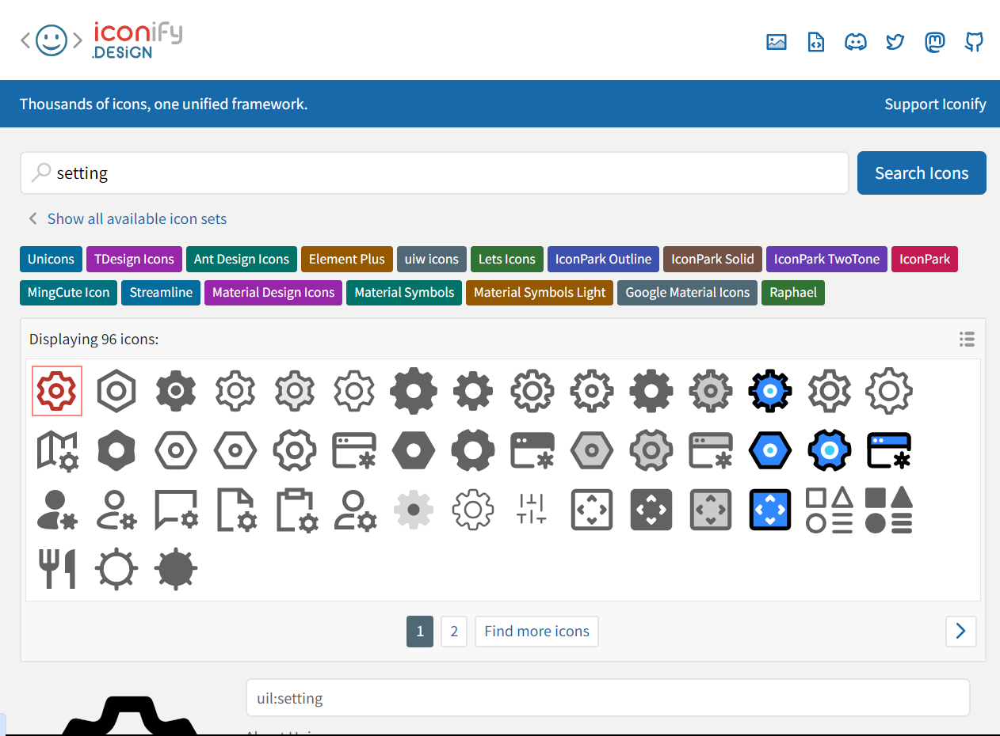
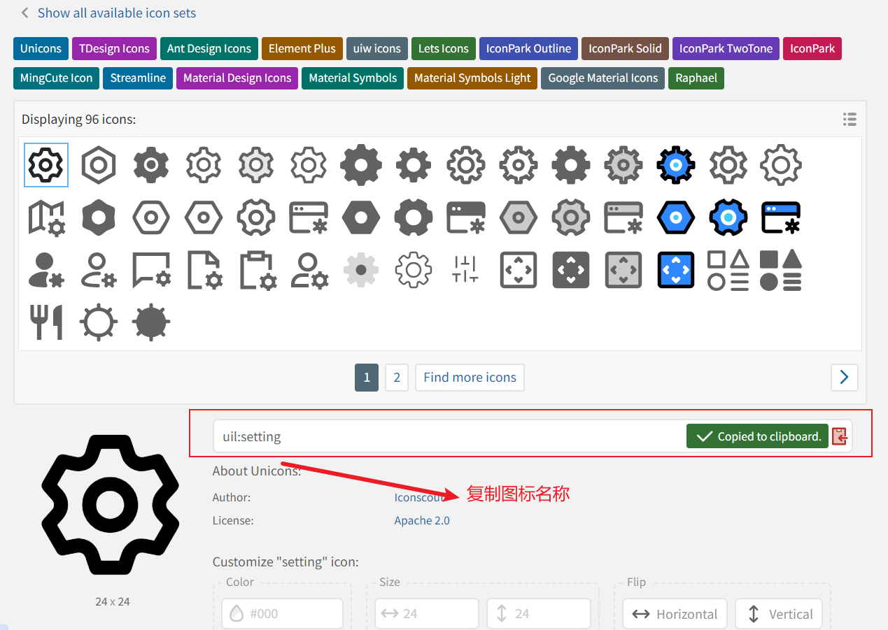

# windy-react-admin

windy-react-admin是一个基于ant design 和 使用react+ts 的后台系统模板。内置了权限管理，动态路由等, eslint，提交进行校验等。

## 前言

这是react学习，自己实战产品，只为了能够提供一个后台模板，能够在后期写项目时能够有一个模板不需要从新写。
这个项目有很多不完善和处理不是很好的地方，后面陆续完善。
此项目现阶段系统管理功能是与koa写的后台接口集成，后台项目地址：https://github.com/windyeasy/koa-admin-template

使用pnpm作为包管理工具，菜单图标使用`iconify`: https://github.com/iconify/iconify，这个库支持很多开源图标

## 提交方法

由于使用了commitizen对提交进行验证，需要使用如下几种方法提交

- 方法一：

```shell
pnpm run commit
```

- 方法二：提交时直接使用规范的格式

```shell
git commit -m "feat: 添加一个新特性"
```

## 运行使用

- 克隆项目
  ```shell
  git clone https://github.com/windyeasy/windyeasy-react-admin.git
  ```
- 安装依赖

```shell
cd windyeasy-react-admin
pnpm install
```

- 启动
  - 现阶段使用koa写后台接口，请先去搭建和启动后台服务（API接口项目：https://github.com/windyeasy/koa-admin-template）后在启动项目
  ```shell
  pnpm start # 启动项目
  ```

## 如何使用菜单图标

菜单用途使用了iconify(https://github.com/iconify/iconify)库，这里简单介绍如何展示菜单图标

1. 打开iconify图标搜索网站搜索图标：https://icon-sets.iconify.design/
   
   
2. 复制图标名称到菜单的图标字段，就可以使用图标为角色绑定菜单后就可以使用图标，重新登录后加载菜单就能看见图标了
